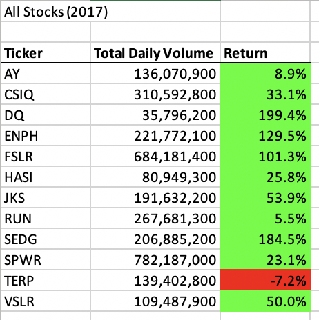
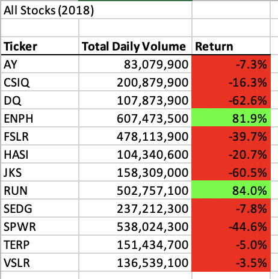
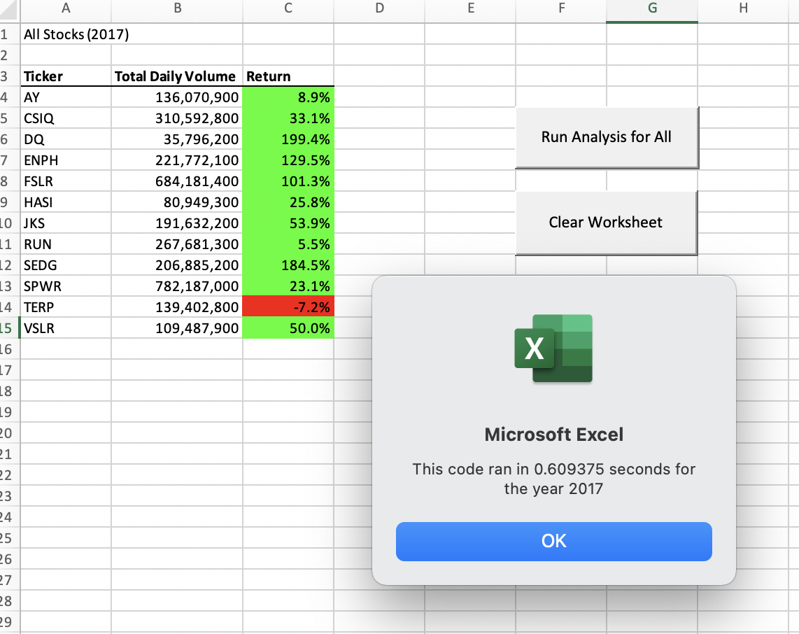
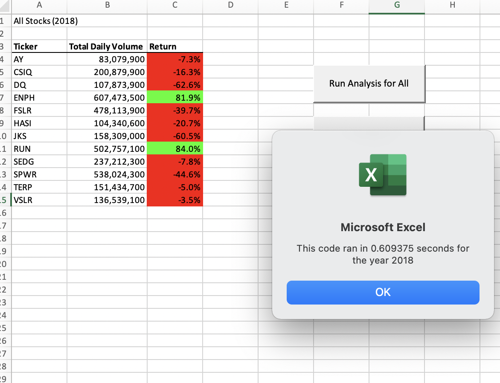
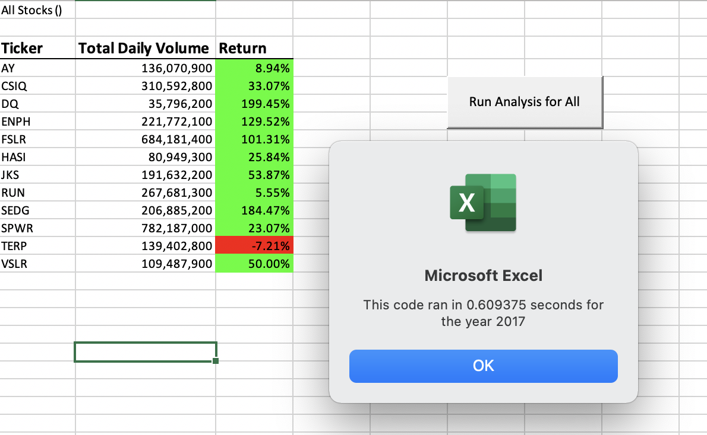
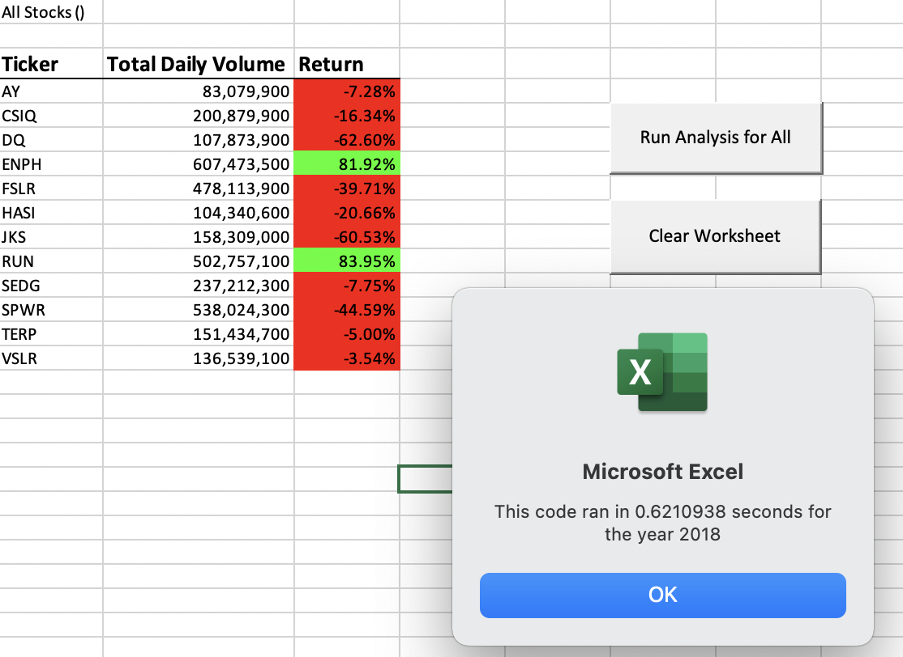

# Analysis of Green Energy Stocks
  VBA analysis of Green Energy Stocks for 2017 & 2018.

## Introduction & Project Overview

An original script for VBA analysis of Green Energy stock was created to analyze the performance of 12 different Green Energy stocks in the years 2017 and 2018. The goal of this project was to refactor the original script to make it gather the same information, only faster. This project was taken on to ensure that this code can run efficiently and accurately if used to run analysis of the entire stock market, versus the dozen stocks that the original code was written to analyze.

## Results

### Comparison of 2017 and 2018 Return
  
  This analysis was performed to assess the performance of each stock based on its **Yearly Volume**, how often the stock gets traded, and its **Yearly Return**, the percentage increase (or decrease) in stock price from the beginning of the year to the end of the year.
  
  Below are screenshots of the VBA Analysis generated with the refactored code:
  
 
 
  
 
 Based on the above analysis, we can make the following comparisons to the stock performance between 2017 and 2018:
 
  - Green Energy Stocks in general saw a significant decrease in performance in 2018 from 2017.
  - The amount that a stock is traded, its Yearly Volume, does not necessarily influence it's Yearly Return.
  - DQ's stock plummeted in 2018, going from having the highest Yearly Return in 2017 to the lowest Yearly Return in 2018.
  - If I were to advise someone on where best to invest their money, based on 2017 and 2018 data, ENPH and RUN have continued to see positive returns accross the last two years.
  
### Comparison of Execution Times
#### Refactored Script vs. Original Script

When refactoring this VBA script, two considerations were taken into account:

 1. Improving the processing speed of the code.
 2. Updating variable names to more specifically describe what data they represent.
 
 
##### Improving the Processing Speed 

   The original script was using two independent loops; one loop to calculate the Volume and a separate loop to calculate the Return. 
    
    Dim startingPrice As Double
    Dim endingPrice As Double
    
   In order to make the code more run more efficiently, the re-factored code includes the tickerVolumes as an output array in the same loop as the tickerStartingPrices and tickerEndingPrices.
   
    Dim tickerVolumes As Long
    Dim tickerStartingPrices As Single
    Dim tickerEndingPrices As Single
  
  As a result of the refactoring, we saw an increase in the processing speed for the 2018 worksheet and an identical processing speed for the 2017 worksheet (shown in the screenshots below):
  
  ###### Processing Speeds of the Refactored Script
  
 
  
  
  
  ###### Processing Speeds of the Original Script
  
 
  
  
 
 
##### Updating Variable Names
  
   When refactoring the VBA code, we updated the names of the output arrays to more specifically reflect the dataset. This makes the code easier to read and understand.
   
   Original Script:
    
      Cells(4 + i, 1).Value = ticker
      Cells(4 + i, 2).Value = totalVolume
      Cells(4 + i, 3).Value = endingPrice / startingPrice - 1
  
  Refactored Code:
  
      Cells(4 + i, 1).Value = tickerIndex
      Cells(4 + i, 2).Value = tickerVolumes
      Cells(4 + i, 3).Value = tickerEndingPrices / tickerStartingPrices - 1
 
 ## Summary
 ### Advantages and Disadvantages of Refactoring Code
 
 **For refactoring code in general:**
  
  Generally speaking, the first attempt at writing a code to accomplish a specific task might not be the best solution. By refactoring, we can update the code to take fewer steps, run faster and use less memory. In addition to this, refactoring code can make it easier for users to read and understand. 
  
  However, refactoring code also has disadvantages. There is a potential risk of introducing bugs and stopping a previously functional code from running. In addition to this, refactoring code requires an additional time investment layered on top of the time taken to write the original script. This additional time invested might only yield an improved processing time of merely factors of a second and ultimately produces the same end product as the original code. 

**For the Refactored VBA Script:**
  
  In this assignment specifically, the refactored VBA script did make the code run faster when looping through the 2018 Worksheet. In addition to this, the refactored VBA Script is both easier for users to read and to understand.
  
  However, while the refactored code did slightly improve the processing time for the 2018 Worksheet, this improvement was small in relation to the time that it took to refactor the code. Also, the process of refactoring the code resulted in several instances where the code did not run. This required additional time to debug the updates to the code so that it could run correctly.
  
